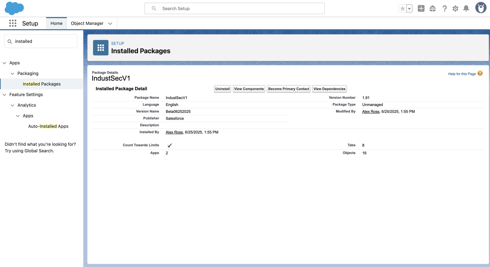
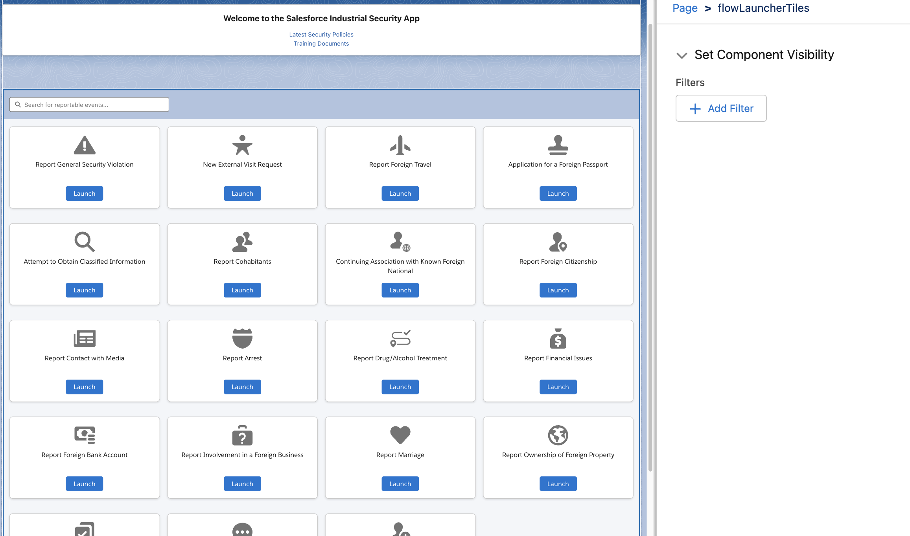

# Industrial Security App Guide

*Last Updated: 9/4/2025*

**Content**

1. About the App 
2. Salesforce Unmanaged Package Flexibility & Disclaimer
3. License Compatibility & App Design Considerations
4. Objects & Included Permission Sets
5. Org Requirements & Setup Prerequisites  (Required before Install)
6. Installation and Setup Instructions 
7. Optional Setup Instructions
8. Included Flows & SEAD-3 Workflows
9. Data Model Diagram
10. Included Lightning App Pages & Recommended Assignments

* * *

### _**1. About the App**_

* Authors: 
    * Alex Ross, Sr. Salesforce SE
    * John Schneider, Lead Salesforce SE 
* This solution was developed as part of Salesforce’s [**Global Public Sector Accelerator Program**](https://gpsaccelerators.developer.salesforce.com/), which provides ready-to-use apps and templates tailored for government, defense, and aerospace use cases. 

* * *

### _2. Salesforce Unmanaged Package Terms of Use_

Thank you for using Public Sector Accelerators. Accelerators are provided by Salesforce.com, Inc., located at 1 Market Street, San Francisco, CA 94105, United States.

By using this site and these accelerators, you are agreeing to these terms. Please read them carefully.

Accelerators are not supported by Salesforce, they are supplied as-is, and are meant to be a starting point for your organization. Salesforce is not liable for the use of accelerators.

In addition, this accelerator tool is intended to provide capabilities for Customers to configure and optimize use of their implemented Salesforce Services. Customers should ensure that their use of this tool meets their own use case needs and compliance requirements (including any applicable public sector and privacy laws, rules, and regulations).

* * *

### _3. License Compatibility & App Design Considerations_

This solution was designed to work primarily with **Salesforce Platform Plus licenses** to ensure broad compatibility across user types without requiring full Sales or Service Cloud licensing. However, certain user roles—such as **Facility Security Officers (FSOs)**—require additional capabilities that are not supported by Platform licenses.

####  License Recommendations by Role:

* **FSO Users** must have at least a **Salesforce (core Sales Cloud or Service Cloud) license**, as they need access to the **User** object and other setup-level features to manage personnel, view user records, and oversee security workflows.
* **Employee Users** only require a **Salesforce Platform Plus license**, which provides sufficient access to interact with their own records, submit reportable events, and use self-service flows.

### Custom Object Limits by License:

|License Type	|Custom Object Limit	|Notes	|
|---	|---	|---	|
|Platform	|10	|Designed for lightweight apps	|
|Platform Plus	|110	|Suitable for complex apps and larger data models	|

* If your org uses Platform licenses, be aware that users may hit the 10-object limit if the app includes many related custom objects.
* The app was designed with Platform Plus scalability in mind but can still operate under basic Platform licenses if usage is limited to core objects.

Recommendation: Assign Platform Plus licenses to all Employee users and Salesforce (core) licenses to all FSOs for full functionality and scalability.

* * *

### **4. Objects & Definitions** 

**Individual Object**

* In our Industrial Security App, we leverage the Salesforce standard Individual object as a central hub to represent each employee within the app. The Individual object acts as a flexible, reusable data model that stores detailed personal and employment information for different categories of employees across the organization.
    * **One Individual = One Employee**
        * Each Individual record uniquely represents a single employee at a company. This clear mapping ensures accurate tracking of individual employees for security, compliance, and reporting purposes.
    * **User Record Required First**
        * Before creating a new Individual record, a corresponding User record must already exist in Salesforce.
        * Once linked, the Individual object will automatically pull in User-specific data, such as the profile picture, email, and other attributes.
        * Support security and access control by ensuring each Individual is tied to an authenticated user.
            * For example, when an Employee logs in, this ensure that only that User can access their related Industrial Security Profile
* **Profiles & Permission Sets**
    * Note: This unmanaged package does not include any user profiles. Lightning Record Page assignments must still be configured through your own profiles. However, the package does include two permission sets:
        * **`INDSEC_Individual_Reporter
            `**
            * Grants access suitable for employee users submitting reportable events
            * Permissions:
         

| Category               | Details |
|------------------------|---------|
| **Assigned Apps**      | Employee Center (`Employee_Center`) |
| **Object & Field Permissions** | **Read Only:**  - Alerts    **Read, Create, Edit, Delete:**  - Reportable Events   - Foreign Travel Passports (Junction object)   - Contact Point Emails   - Contact Point Addresses   - Cohabitants   - Emergency Contacts   - Foreign Travel Passports   - Individual   - SMO Contacts   - Trip Legs   - Trip Lodging   - Visit Requests Individuals    **Additional Permissions:**  - Individual: View All Records   - Individual Files: Read, Create, Edit   - Contact Point Passports: Read All / Modify All   - Security Violations: Read All / Modify All   - Travel Emergency Contacts (Junction object): Read, Create, Edit   - Travel Warning Acknowledgements: Read, Create, Edit   - Travel Warnings: Read, Create, Edit   - Visit Requests: Read, Create, Edit |
| **Apex Classes**       | - AlertController   - AlertControllerTest   - CommList_EditRL_LookupFieldCC   - CommList_EditRL_LookupFieldCCTest   - CommList_PicklistOption   - CommList_PicklistService   - CommList_PicklistServiceTest   - CommList_RelatedListEditorCC   - CommList_RelatedListEditorCCTest   - IndividualFileController   - IndividualFileControllerTest   - IndividualFileListController   - IndividualFileListControllerTest   - IndividualFileViewerController   - IndividualFileViewerControllerTest   - IndividualProfileCardController   - IndividualProfileCardControllerTest   - IndividualRecordController   - IndividualRecordControllerTest   - PassportController   - PassportControllerTest   - RedirectToProfileController   - RedirectToProfileControllerTest   - TileFlowMappingController   - TileFlowMappingControllerTest   - TravelAdvisoryHandler   - TravelAdvisoryHandlerTest   - TravelWarningController   - TravelWarningControllerTest |
| **Custom Metadata Types** | - Tile Flow Mapping |

        * **`INDSEC_Security_Team`**
            * Grants broader access for members of the security team handling investigations or incidents.
        * Permissions: 

| Category               | Details |
|------------------------|---------|
| **Assigned Apps**      | - INDSEC FSO (`Industrial_Security_Standard`)   - INDSEC Employee (`Employee_Center`) |
| **Object & Field Permissions** | **Objects with Read All / Modify All / Tab Available:**   - Alerts   - Reportable Events    **Objects with Read All / Modify All:**   - Foreign Travel Passports (Junction object)   - Contact Point Passports   - Cohabitants   - Emergency Contacts   - Individual Files   - Security Violations   - Travel Emergency Contacts (Junction object)   - Travel Warning Acknowledgements   - Travel Warnings   - Trip Legs   - Trip Lodging   - Visit Requests Individuals    **Tab Available Only:**   - Visit Requests    **Other Objects (Permissions Not Specified):**   - Contact Point Addresses   - SMO Contacts |
| **Apex Classes**       | - AlertController   - AlertControllerTest   - CommList_EditRL_LookupFieldCC   - CommList_EditRL_LookupFieldCCTest   - CommList_PicklistOption   - CommList_PicklistService   - CommList_PicklistServiceTest   - CommList_RelatedListEditorCC   - CommList_RelatedListEditorCCTest   - IndividualFileController   - IndividualFileControllerTest   - IndividualFileListController   - IndividualFileListControllerTest   - IndividualFileViewerController   - IndividualFileViewerControllerTest   - IndividualProfileCardController   - IndividualProfileCardControllerTest   - IndividualRecordController   - IndividualRecordControllerTest   - PassportController   - PassportControllerTest   - RedirectToProfileController   - RedirectToProfileControllerTest   - TileFlowMappingController   - TileFlowMappingControllerTest   - TravelAdvisoryHandler   - TravelAdvisoryHandlerTest   - TravelWarningController   - TravelWarningControllerTest |
| **Custom Metadata Types** | - Tile Flow Mapping |

    * We recommend assigning these permission sets to users based on their role if you are installing into a new org. **You may still need to create or update your own profiles** (e.g., an *Employee Profile*) to control visibility of Lightning Record Pages and tab assignments.
    * Note: discuss with your admin that you may need to grant additional System/App Permissions such (Create and Customize Dashboards or Run Flows) as these are also not included with unmanaged packages. 
        * FSO will need access to view all Users (this is a System Permission)

* * *

### **_5. Org Requirements & Setup Prerequisites_ (Required before Install)**

* Enable **Custom** **Addresses** (if not already enabled)
    * **Steps:**
        * Navigate to **Setup**.
        * In the Quick Find box, type: **User Interface**
        * Select **User Interface** (near the bottom after Translation Workbench)
        * Scroll to the **Setup** section.
        * Check the box: **Use custom address fields**
        * Click **Save**.
        * 
        * Note: This setting is **permanent** and cannot be undone once enabled. Review [feature limitations](https://help.salesforce.com/s/articleView?id=release-notes.rn_forcecom_field_def_address.htm&type=5) before proceeding.
        * After enabling this setting, you can proceed with the installation. This enables support for the `Address` field type used in custom objects like `Emergency Contact`, `Trip Lodging`, and others in this package.

* * *

### _6. Installation and Setup Instructions_

1. Navigate to the Industrial Security App download URL:
    1. Installation URL: https://login.salesforce.com/packaging/installPackage.apexp?p0=04tak000000930H
    2. Version Number: 2.0
    3. Version Name: Summer 2025
2. Enter the credentials of the org you wish to install the unmanaged package into

1. On the Install Screen, first select **Do not install** under the conflicting component names. 
2. Also, select **Install for Admins Only**. 
3. Then select, **Install**. 
4. 
5. After you select Install, a Third-Party Access option will display. Select **Yes, grant access to these third-party web sites** if you wish to use the U.S. Department of State API to display real-time travel warnings.
    1. This API integration only pulls data from the State Department’s Travel Advisory website. No data will ever leave your Salesforce org to a third party system. 

1. You’ll see a notification indicating that the installation may take a while—this is normal.

1. After receiving the **successful** **installation email**, confirm the install by checking the unmanaged package under **Installed Packages** in Setup. 
2. 
3. **Test Drive the new INDSEC Apps as an Admin**
    1. Start by exploring the included apps from both perspectives:
    2. Open the **Salesforce App Launcher**
    3. Search and launch the **INDSEC FSO** and **INDSEC Employee** apps
        1. **Important:** Don’t click around or submit anything just yet such as submitting Reportable Events and running flows. Follow the steps in the sections below first to get the full guided experience.
    4. 
    5. The included apps should look like this for an admin: 
        1. 
        2. 
4. **Setup a Facility Security Officer User (Admin Required)**
    1. Follow these instructions for users who will be your FSO users. FSOs are users who need access to the **INDSEC FSO** app and the **INDSEC Employee** app.
    2. **Steps:**
        1. Create a New User & Assign a Profile
            1. Follow your organization's standard process to create a new Salesforce User (skip this step if the User already exists).
                2. Note: FSO users will need at least a Core Salesforce license
                3. Assign or Create a new Salesforce Profile to the User
                    1. For example, clone the Standard Profile and name it “Standard - FSO”
        2. Assign the **INDSEC - Security Team** permission set to the new or existing User:
            1. Search Setup for **Permission Sets**: 
            2. Locate the Industrial Security Permission Sets: 
            3. 
            4. Select the **INDSEC - Security Team** permission set
            5. Select **Manage Assignments**
            6. Add your FSO users to the permission set
        3. This will grant the user access to the **INDSEC FSO** app
            1. Note: discuss with your admin that you may need to grant additional System/App Permissions such (Create and Customize Dashboards or Run Flows). 
            2. FSO will need access to view all Users (this is a System Permission)
5. **Activate and Assign Industrial Security Lightning Page Layouts (Admin)**
    1. Navigate to **Setup**.
    2. In the **Quick Find** box, type: **Lightning App Builder**.
    3. Select **Lightning App Builder**.
    4. Locate the Lightning Pages for Industrial Security (they start with `INDUST SEC` or `INDSEC`):
        1. Pages ending with **Employee View** → Assign to Employee profiles.
        2. Pages ending with **FSO View** → Assign to FSO profiles or System Admins.
            1.  (ie **INDSEC - Individual Record Page**) 
    5. 
    6. Click **Edit** next to the desired Lightning Page to open the app builder interface:
    7. 
    8. In the Lightning App Builder interface, click “**Activation...“** in the upper right corner
    9. In the modal, select the APP**, RECORD TYPE, AND PROFILE** tab
    10. Click **Assign to Apps, Record Types, and Profiles**.
    11. 
    12. Choose Apps for visibility:
        1. `INDSEC - Employee`
        2. `INDSEC - FSO`
    13. Click **Next**.
    14. Select **Desktop and Phone**.
    15. Click **Next**.
    16. Choose the appropriate **Record Type** (e.g., select “Adoption” for Adoption Page Layout).
        1. NOTE - for the **INDSEC - Individual Record Page**, add it to all Record Types
        2. 
    17. Click **Next**.
    18. Choose the **Profile**:
        1. For all Employee Views → Employee profiles.
        2. For all FSO Views → FSO profiles and System Admins.
    19. Review assignments.
    20. Click **Save**.
    21. Recommended Page Layout Assignments:
6. **Actions Required by the FSO Upon Receiving Access to the Industrial Security Apps:**
    2. Have the FSO user login to the org
    3. Navigate to the **INDSEC FSO** App
    4. The layout should look like this 
    5. 
    6. Select the **Employee Management** tab
    7. Select the “**+ New Individual**” button to launch a screen flow to add the FSO user as an Individual:
    8. 
    9. In the Individual Type field, select “**Security Officer**”:
    10. 
    11. Search and select the User record for this Individual: 
        1. **Note:** The **User** field is required. A Salesforce User record must be created before you can create an Individual record in the Industrial Security app.
    12. 
    13. Fill out the remaining Employee Details then click **Next**
    14. Fill out the Employment & Role Details then click **Next**
        1. Note: the first 5 digits of the Social Security number will be encrypted upon saving
    15. Fill out the Security & Clearance Details  then click **Next**
    16. Once submitted, **refresh** the Employee Table to see the newly created Employee record:
    17. 
    18. Click on the name of the Employee to access their Industrial Security Individual page: 
    19. 
    20. The user can now start to add items such as 
        1. Passports
            1. Required to submit Foreign Travel events
        2. Emergency Travel Contacts
            1. Required to submit Foreign Travel events
        3. Personal Adresses
        4. Personal Phone Numbers
        5. Personal Email Addresses
    21. Note**:** the Individual profile picture will automatically sync with the Salesforce user profile image when updated:
    22. 
7. **FSOs: Follow these steps to set up Employee access in the FSO app.**
    1. Once a User has been created by an Admin (or if one already exists), follow these steps:
    3. **Configure the Employee in the Industrial Security App**
        1. Log in as an FSO User
        2. Navigate to the **INDSEC FSO** app
        3. On the Home page, select the **Employee Management** tab.
        4. Follow the same steps you used to create a new FSO, but select **Internal Employee** during the workflow:
        5. 
    4. **Emergency Contacts**
        1. Make sure at least one Emergency Contact is added to their profile before they can submit Reportable Events
    5. **Passports** 
        1. Make sure at least one Passport is added to their profile before they can submit Reportable Events
        2. Dynamic passport alerts will be shown on their profile only if the active passport on file expires within 2 months.
        3. 
8. **Set Up the Facility Security Officer Queue (FSO or Admin can do this)**
    1. This app uses a **Queue** to automatically assign all **Reportable Events** to a dedicated queue as the **Owner**, managed by the “**INDSEC - Assign RE to FSO Queue”** unmanaged flow.
    2. NOTE - the Reportable Event Tile Flows will **fail** if this is not setup
    3. **Steps:**
        1. Go to **Setup**.
        2. In the **Quick Find** box, search for **Queues** and select it under the **Users** section.
        3. Click **New**.
        4. 
        5. Enter:
            1. **Label:** e.g., *FSO Team*
            2. **Queue Name**
            3. **Queue Email** (optional)
            4. **Description** (optional)
            5. **Omni-Channel Routing** (optional)
        6. Under **Available Objects**, select **Reportable Event**.
        7. Under **Queue Members**, add the users who should be part of the queue.
        8. Ensure the **INDSEC - Assign RE to FSO Queue** flow is configured to assign the **OwnerId** to this queue:
            1. NOTE - Most Industrial Security components will start with the INDSEC prefix 
        9. 
9. **Adjust the Foreign Travel Report Attestation Document (optional)**
    1. There is a Subflow within the I**NDSEC - Foreign Travel Report** flow that displays a travel attestation document. This document can be adjusted to your own liking: 
        1. Open the **Files** object from the App Launcher
        2. Upload your document of choice (PDF)
        3. Click on the File record that stores the document and copy the record ID from the URL 
        4. Open up the Developer Console by clicking the gear icon → Developer Console
        5. Enter the following SOQL query to retrieve the Version ID in the Query Editor tab in the Console
            1. *`SELECT Id, Title, ContentSize, CreatedDate, VersionNumber`*
            2. *`FROM ContentVersion`*
            3. *`WHERE ContentDocumentId = 'YOUR_RECORD_ID'`*
            4. *`ORDER BY VersionNumber DESC`*
            5. 
        6. Open the **INDSEC - Counterintelligence Tips for Safe Travel** flow 
        7. Open the **Acknowledgement Screen** flow component 
        8. Select the **View PDF File** section and enter the following attributes: 
            1. Content ID: Enter the record ID here
            2. Version ID: Enter the ID in the first column in the SOQL query (ID)
        9. Save the flow as a new version 
        10. Select **Activate**
        11. The document will now be shown embedded in the flow 
10. **Refresh or Schedule the Department of State Travel Warnings Integration**
    1. Manual Refresh Steps:
        1. Navigate to the **INSEC FSO** app as an FSO user
        2. Select the **Travel Advisory Management** tab on the Home Page
        3. Click “**Retrieve Now**” 
        4. **Refresh** the Current Travel Advisories list (refresh icon next to New)
        5. 
    2. Note - the Travel Advisory icons are stored in **Static Resources** in Setup and can be edited. 
    3. **Automatic** Scheduling Steps:
        1. Navigate to **Setup**
        2. Search for “Scheduled” 
        3. Select “Scheduled Jobs” under Jobs
        4. Select the **Schedule Apex** button
        5. Enter a Job Name such as “Travel Warning Job” 
        6. Apex Class: **TravelAdvisoryHandler**
        7. Schedule it to run Daily, Weekly, or Monthly 

### _**7. Optional Setup & Configuration**_

1. **Managing Employee Alerts**
    1. Custom alerts can be created by an FSO user and displayed on the INDSEC Employee app Home page to all employees. 
    2. To create an alert: 
        1. Navigate to the **INDSEC FSO** app 
        2. Select the **Manage Alerts** tab on the Home Page: 
        3. 
        4. Select **New** on the All Alerts table
        5. Fill out the Alert details: 
        6. 
        7. Check the **Is Active** box if you want to activate this Alert
        8. Select **Save**
        9. Navigate to the **INDSEC Employee** app. The new alert will now be displayed:
        10. 
        11. Select **Expand** to see more details: 
        12. 
        13. Select **Save**
        14. **Note:** Only 1 alert can be active at a time. Uncheck an alert to disable it. 
        15. To manage your alerts, return to the INDSEC FSO app to see the full list of alerts:
        16. 
        17. Select the pencil icon on the **All Alerts** table to manage alerts or create new alerts:
        18.
2. **Adjusting the INDSEC Employee Home Tiles**
    1. The Home Tiles are controlled by a Lightning Web Component (flowLauncherTiles) that can be adjusted: 
        1. 
        2. To adjust, search for **Custom Metadata Types** in Setup:
        3. 
        4. Select **Manage Records** next to the **Tile Flow Mapping** Custom Metadata Type
        5. This will display all of the records that each represent a tile. 
        6. Select Edit next to a record to edit tile details:
        7. 
        8. The following fields can be customized:
            1. **Label** – The display name of the record.
            2. **Tile Flow Mapping Name** – The API name used for referencing the record.
            3. **Flow API Name** – The API name of the Flow that the tile will launch when clicked.
            4. **Icon Name** – Specifies which icon will appear on the tile.
            5. **Sort Order** – Determines the tile’s position on the Home Page.
            6. **Tile Label** – The visible title displayed on the tile.
            7. **Help Text** – Optional text shown when a user hovers over the tile for additional guidance.
3. **Managing Toast Messages in Flows**
    1. An included custom Aura component enables enhanced toast messages within Flows. This component allows you to display customizable messages with clickable links—such as directing users to newly created records. This Flow Action is pre-configured in most Flows included in the unmanaged package for immediate use.
    2. 
    3. Action Details:
        1. Name: Show Toast Flow Action
        2. API Name: component-c:ToastFlowActionAura
        3. 
    4. The included flows already have this Action configured but you can edit the following: 
        1. Create a Toast Message formula Variable if you wish to include an embedded link in the message:
            1. In Flow Builder, click **New Resource**.
            2. Set **Resource Type** to **Formula**.
            3. Set **Data Type** to **Text**.
            4. Use the following formula to build a dynamic link to a record:
                1. `LEFT({!$Api.Partner_Server_URL_340},FIND("/services", {!$Api.Partner_Server_URL_340})) & {!IndividualRecordId}`
            5. Replace `{!IndividualRecordId}` with any other record variable as needed.
            6. For example, to link to a newly created Reportable Event, use `{!varReportableEventId}` instead.
            7. Select **Save**
        2. Set Input Values:
            1. **Mode** – Only s**ticky** is supported at this time. The message will stay on screen until the user closes it or clicks the embedded link.
            2. **Toast Message** – The main body text of the message. Use plain text.
            3. **Toast Title** – The heading/title shown in the toast.
            4. **Variant** – Currently, only the default variant is supported.
            5. **URL Label** – The display text for the clickable link (e.g., "View Record").
            6. **URL Link** – Insert the formula resource created earlier.
        3. 
4. **Configuring List Editor Components**
    1. As part of this unmanaged app, we’ve embedded the Salesforce Labs **List Editor** LWC. This component provides a cleaner, fully customizable experience for viewing and managing related lists. It also enables users to create, edit, and manage records directly within the table view.
    2. This component is used across many of our Industrial Security Lightning pages—including the Home screen, as shown below:
    3.
    4. To adjust the LWC:
        1. Select the **Setup** gear icon 
        2. Select **Edit Page**
        3. 
        4. Click on the **List Editor** component
        5. 
        6. In the right-hand panel, you can customize the following settings:
            1. Object to display
            2. Fields shown in the table
            3. Component label
            4. Sort order (ascending or descending)
            5. Header colors and styling
5. **Customize the INDSEC Employee Home Bookmarks**
     The Employee Home page includes a Rich Text component that displays helpful links and information. To update the content:
    1. Click the **Setup** gear icon (top right)
    2. Select **Edit Page**
    3. Click on the **Rich Text** component
    4. Edit the text as needed to customize bookmarks or instructions
    5. 

* * *

### _8. Flows_

This unmanaged package includes 29 fully customizable Flows, allowing you to tailor screens, fields, and logic to meet your organization’s specific needs. 17 of the included Flows are directly aligned with reportable event categories outlined in the official SEAD-3 directive.

Note: Press the ESC key to exit a flow

| Flow Name                                        | Process Type   | Objective                                      | Description                                                                 | SEAD-3 Related |
|--------------------------------------------------|----------------|-----------------------------------------------|-----------------------------------------------------------------------------|----------------|
| INDSEC - Adoption                                | Screen Flow    | Creates a new Reportable Event Record & Event UI | Used to report the adoption of a child, as required under SEAD-3.           | Yes            |
| INDSEC - Application for a Foreign Passport      | Screen Flow    | Creates a new Reportable Event Record & Event UI | Submit information about applying for or renewing a foreign passport.       | Yes            |
| INDSEC - Arrest                                  | Screen Flow    | Creates a new Reportable Event Record & Event UI | Used by employees to report an arrest or legal detainment.                  | Yes            |
| INDSEC - Assign RE to FSO Queue                  | Autolaunched   | Workflow Utility                               | Routes a submitted reportable event to the appropriate FSO queue.           |                |
| INDSEC - Attempt to Obtain Classified Information| Screen Flow    | Creates a new Reportable Event Record & Event UI | Report suspicious attempts to access classified information.                | Yes            |
| INDSEC - Continuing Association with Known Foreign National | Screen Flow | Creates a new Reportable Event Record & Event UI | Used to report ongoing contact with a known foreign national.               | Yes            |
| INDSEC - Counterintelligence Tips for Safe Travel| Screen Flow    | Awareness & Training                           | Provides tips to employees for traveling safely abroad. Used as subflow in Travel Flow. |                |
| INDSEC - Create New Individual                   | Screen Flow    | Creates a new Individual Record                | Used by FSOs to create a new individual record in the system.               |                |
| INDSEC - Create New Visit Request                | Screen Flow    | Creates a new Request record                   | Used to initiate and submit a new visit request.                            |                |
| INDSEC - Create Travel Acknowledgment            | Autolaunched   | Compliance                                     | Automatically creates an acknowledgment when a travel warning is present.   |                |
| INDSEC - Create Travel Acknowledgment from Trip Log | Screen Flow | Compliance                                     | Generates an acknowledgment tied to a specific trip log.                    |                |
| INDSEC - Create Travel Acknowledgment from Trip Lodging | Screen Flow | Compliance                                     | Generates an acknowledgment tied to a lodging entry.                        |                |
| INDSEC - Emergency Contact                       | Screen Flow    | Personal Management                            | Allows employees to update their emergency contact information.             |                |
| INDSEC - Financial Issue                         | Screen Flow    | Creates a new Reportable Event Record & Event UI | Report significant financial events that could impact clearance.            | Yes            |
| INDSEC - Foreign Bank Account                    | Screen Flow    | Creates a new Reportable Event Record & Event UI | Used to report the opening or use of foreign bank accounts.                 | Yes            |
| INDSEC - Foreign Citizenship                     | Screen Flow    | Creates a new Reportable Event Record & Event UI | Report foreign citizenship status or changes.                               | Yes            |
| INDSEC - Foreign Election                        | Screen Flow    | Creates a new Reportable Event Record & Event UI | Report involvement in foreign political campaigns or elections.             | Yes            |
| INDSEC - Foreign Travel Report                   | Screen Flow    | Creates a new Reportable Event Record & Event UI | Submit a report for upcoming or recent foreign travel.                      | Yes            |
| INDSEC - Involvement in a Foreign Business       | Screen Flow    | Creates a new Reportable Event Record & Event UI | Report ownership or involvement in a foreign business entity.               | Yes            |
| INDSEC - Marriage                                | Screen Flow    | Creates a new Reportable Event Record & Event UI | Used to report marriage, as required under SEAD-3 guidelines.               | Yes            |
| INDSEC - Media Contact                           | Screen Flow    | Creates a new Reportable Event Record & Event UI | Report unsolicited or suspicious contact by media personnel.                | Yes            |
| INDSEC - Ownership of Property Report            | Screen Flow    | Creates a new Reportable Event Record & Event UI | Report ownership or purchase of property in a foreign country.              | Yes            |
| INDSEC - Reportable Event Escalation             | Screen Flow    | Escalates a Reportable Event record to an FSO for review | Escalates a submitted reportable event to an FSO for review.              |                |
| INDSEC - Security Violation                      | Screen Flow    | Creates a new Security Violation Record & Event UI | Used to report actual or suspected violations of security protocols.        | Yes            |
| INDSEC - Unofficial Contact with a Foreign Entity| Screen Flow    | Creates a new Reportable Event Record & Event UI | Report any unapproved or informal contact with foreign entities.            | Yes            |
| INDSEC - Update Individual User ID Field         | Autolaunched   | Utility                                        | Auto-updates the text field storing the user’s 15-char ID.                  |                |
| INDSEC - Update Individual with State Dept Travel Advisory | Autolaunched | Utility | This Record-Triggered Flow runs when a User record is updated; it performs the advisory update. |                |
| INDSEC - Upload Drug Treatment Program           | Screen Flow    | Creates a new Reportable Event Record & Event UI | Facilitates and updates the latest travel warnings from the State Department. | Yes          |
| INDSEC - Alcohol and Drug Treatment              | Screen Flow    | Creates a new Reportable Event Record & Event UI | Used to report entry into alcohol or drug treatment programs.               | Yes            |

* * *

### _9. Data Model Diagram_ 

* * *

### _10. Recommended Lightning Page Assignments_

|Lightning Page Label	|Type	|Recommended App Assignments	|Record Type Assignment	|Profile Assignments	|
|---	|---	|---	|---	|---	|
|INDSEC - Employee Center App Home Page	|Home Page	|INDSEC Employee	|	|	|
|INDUST SEC - Industrial Security App Home - FSO	|Home Page	|INDSEC FSO	|	|	|
|INDSEC - Visit Request Page - Employees	|Record Page	|INDSEC Employee	|Master	|Use a profile for employees (e.g., **"INDSEC Standard Platform User - Employee"**).	|
|INDSEC - Visit Request Page - FSO View	|Record Page	|INDSEC EmployeeINDSEC FSO	|Master	|Either the System Administrator profile or a custom FSO profile that your admin has created for Facility Security Officers.	|
|INDSEC - Individual Record Page	|Record Page	|INDSEC EmployeeINDSEC FSO	|None - Set as Org Default	|**Note:** Use page layouts on the Individual object to control field visibility and edit access based on the user's role—for example, restricting what an Employee can see versus what an FSO can view or update.	|
|INDUST SEC - Reportable Event - Adoption - Employee View	|Record Page	|INDSEC Employee	|Adoption	|Use a profile for employees (e.g., **"INDSEC Standard Platform User - Employee"**).	|
|INDUST SEC - Reportable Event - Adoption - FSO View	|Record Page	|INDSEC EmployeeINDSEC FSO	|Adoption	|Either the System Administrator profile or a custom FSO profile that your admin has created for Facility Security Officers.	|
|INDUST SEC - Reportable Event - Alcohol - Employee View	|Record Page	|INDSEC Employee	|Alcohol and Drug Treatment	|Use a profile for employees (e.g., **"INDSEC Standard Platform User - Employee"**).	|
|INDUST SEC - Reportable Event - Alcohol - FSO View	|Record Page	|INDSEC EmployeeINDSEC FSO	|Alcohol and Drug Treatment	|Either the System Administrator profile or a custom FSO profile that your admin has created for Facility Security Officers.	|
|INDUST SEC - Reportable Event - Application Foreign Passport - Employee View	|Record Page	|INDSEC Employee	|Application for a Foreign Passport	|Use a profile for employees (e.g., **"INDSEC Standard Platform User - Employee"**).	|
|INDUST SEC - Reportable Event - Application Foreign Passport - FSO View	|Record Page	|INDSEC EmployeeINDSEC FSO	|Application for a Foreign Passport	|Either the System Administrator profile or a custom FSO profile that your admin has created for Facility Security Officers.	|
|INDUST SEC - Reportable Event - Foreign Citizenship - Employee View	|Record Page	|INDSEC Employee	|Foreign Citizenship	|Use a profile for employees (e.g., **"INDSEC Standard Platform User - Employee"**).	|
|INDUST SEC - Reportable Event - Foreign Citizenship - FSO View	|Record Page	|NDSEC Employee
INDSEC FSO	|Foreign Citizenship	|Either the System Administrator profile or a custom FSO profile that your admin has created for Facility Security Officers.	|
|INDUST SEC - Reportable Event - Foreign Election - Employee View	|Record Page	|INDSEC Employee	|Foreign Election	|Use a profile for employees (e.g., **"INDSEC Standard Platform User - Employee"**).	|
|INDUST SEC - Reportable Event - Foreign Election - FSO View	|Record Page	|INDSEC Employee
INDSEC FSO	|Foreign Election	|Either the System Administrator profile or a custom FSO profile that your admin has created for Facility Security Officers.	|
|INDUST SEC - Reportable Event - Foreign Entity - Employee View	|Record Page	|INDSEC Employee	|Foreign Entity	|Use a profile for employees (e.g., **"INDSEC Standard Platform User - Employee"**).	|
|INDUST SEC - Reportable Event - Foreign Entity - FSO View	|Record Page	|INDSEC Employee
INDSEC FSO	|Foreign Entity	|Either the System Administrator profile or a custom FSO profile that your admin has created for Facility Security Officers.	|
|INDUST SEC - Reportable Event - Foreign Property - Employee View	|Record Page	|INDSEC Employee	|Foreign Property	|Use a profile for employees (e.g., **"INDSEC Standard Platform User - Employee"**).	|
|INDUST SEC - Reportable Event - Foreign Property - FSO View	|Record Page	|INDSEC Employee
INDSEC FSO	|Foreign Property	|Either the System Administrator profile or a custom FSO profile that your admin has created for Facility Security Officers.	|
|INDUST SEC - Reportable Event - Foreign Travel - Employee View	|Record Page	|INDSEC Employee	|Foreign Travel	|Use a profile for employees (e.g., **"INDSEC Standard Platform User - Employee"**).	|
|INDUST SEC - Reportable Event - Foreign Travel - FSO View	|Record Page	|INDSEC Employee
INDSEC FSO	|Foreign Travel	|Either the System Administrator profile or a custom FSO profile that your admin has created for Facility Security Officers.	|
|INDUST SEC - Reportable Event - Marriage - Employee View	|Record Page	|INDSEC Employee	|Marriage	|Use a profile for employees (e.g., **"INDSEC Standard Platform User - Employee"**).	|
|INDUST SEC - Reportable Event - Marriage - FSO View	|Record Page	|INDSEC Employee
INDSEC FSO	|Marriage	|Either the System Administrator profile or a custom FSO profile that your admin has created for Facility Security Officers.	|
|INDUST SEC - Reportable Event - Media Contact - Employee View	|Record Page	|INDSEC Employee	|Media Contact	|Use a profile for employees (e.g., **"INDSEC Standard Platform User - Employee"**).	|
|INDUST SEC - Reportable Event - Media Contact - FSO View	|Record Page	|INDSEC Employee
INDSEC FSO	|Media Contact	|Either the System Administrator profile or a custom FSO profile that your admin has created for Facility Security Officers.	|
|INDUST SEC - Reportable Event - Report Arrest - Employee View	|Record Page	|INDSEC Employee	|Report Arrest	|Use a profile for employees (e.g., **"INDSEC Standard Platform User - Employee"**).	|
|INDUST SEC - Reportable Event - Report Arrest - FSO View	|Record Page	|INDSEC Employee
INDSEC FSO	|Report Arrest	|Either the System Administrator profile or a custom FSO profile that your admin has created for Facility Security Officers.	|
|INDUST SEC - General Security Violation Page - FSO	|Record Page	|INDSEC Employee
INDSEC FSO	|Master	|Either the System Administrator profile or a custom FSO profile that your admin has created for Facility Security Officers.	|

